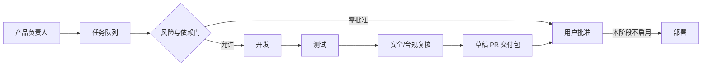

# AI 团队运行模型

## 用户只保留三类职责

1. 决定产品方向和业务优先级。
2. 批准受控写入、高风险动作和发布。
3. 在草稿 PR 中确认结果是否符合预期。

其余背景读取、任务拆解、代码实现、测试、证据整理和风险提示由 AI 团队按仓库规则完成。

## 固定协作链

## 状态机

`backlog → ready → in_progress → done`

任一步可以进入：

- `blocked`：缺少依赖、环境或确定事实。
- `approval_required`：需要用户做产品选择或授权风险动作。

不得用聊天里的“应该完成了”替代状态和证据。任务成为 `done` 前，所有 acceptance tests 必须有实际结果。

## 两种运行节奏

- 每日模式：读取基线，校验队列，选择最多一个任务，完成验证并生成简报。
- 每周模式：只做产品复盘，检查用户路径、业务闭环、指标和队列排序；不自动扩大开发范围。

当前阶段控制器只执行 `validate`、`summary`、`next`，不会改代码、改变任务状态、创建定时任务或部署。隔离执行器属于阶段 3，需另行批准。
