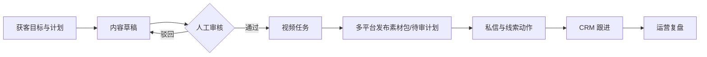

# 业务闭环地图

更新日期：2026-07-29

## 当前可验证的本地链路

| 环节 | 当前产品入口 | 当前能力 | 当前边界 |
|---|---|---|---|
| 计划 | `/workspace/plan` | 保存目标、客户、钩子、渠道和线索目标 | 本地记录 |
| 内容 | `/workspace/review` | 生成草稿、审核/驳回 | AI 可生成，人审保留 |
| 视频 | `/workspace/video` | 从已审草稿生成视频任务与适配清单 | 不做真实转码/发布 |
| 发布 | `/workspace/channels` | 生成平台素材包或待审计划 | 不调用真实平台 |
| 承接 | `/workspace/inbox` | 记录确认、转人工、加入跟进 | 不发送真实私信 |
| CRM | `/workspace/crm` | 展示线索与跟进动作 | 未接真实 CRM |
| 复盘 | `/workspace/analytics` | 演示指标与状态 | 尚未形成真实归因 |

## 距离商业闭环仍缺少

1. 客户开通：真实账号、租户邀请、找回密码、权限与审计。
2. 首次价值：从开通到生成并批准首条内容的耗时和完成率。
3. 渠道结果：官方授权、发布结果回写、评论/私信 Webhook。
4. 销售结果：线索归属、阶段、跟进 SLA、成交/流失原因。
5. 收款交付：合同、支付、服务交付、续费和退款边界。
6. 归因复盘：内容 → 会话 → 有效线索 → 成交 → 续费的可追溯数据。

## 北极星与护栏指标

- 北极星：每周完成“已审核内容 → 有效线索 → 已记录跟进”的活跃租户数。
- 激活：新租户 24 小时内完成获客计划并批准第一条内容的比例。
- 流程：待审核积压、视频任务成功率、发布包完成率、跟进 SLA 达标率。
- 商业：有效线索率、成交率、回款周期、续费率（当前均需真实数据后启用）。
- 护栏：越权写入为 0、未经审核的高风险内容对外发布为 0、真实外部动作均有审计证据。

## 下一实验优先级

先证明“新客户从登录到首条内容获批”能由非技术用户独立完成，再接真实渠道。实验完成条件：5 名目标用户中至少 4 名无需开发人员指导完成，并记录卡点、耗时和放弃原因。
